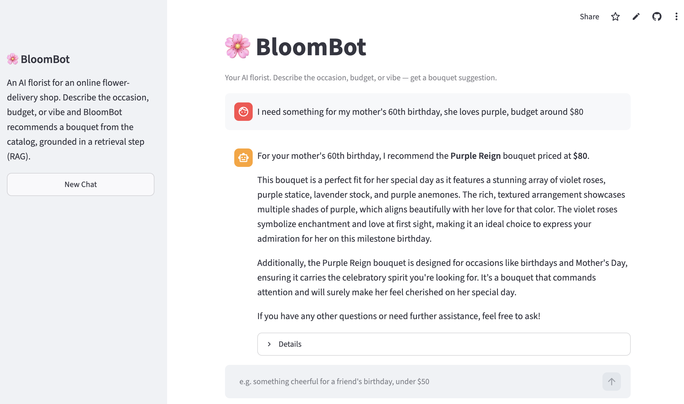
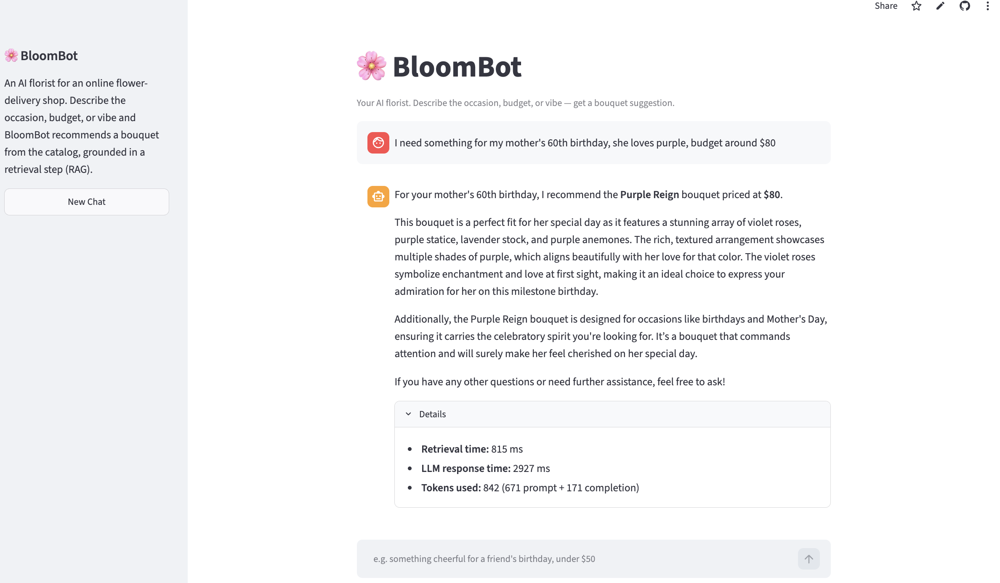

# BloomBot


An AI-powered bouquet recommendation API. Describe what you need in natural language, get back a personalized flower recommendation grounded in a real product catalog.

**Try it live:** [bloombot-your-personal-florist.streamlit.app](https://bloombot-your-personal-florist.streamlit.app/)

## What it does

A customer describes an occasion, mood, or preference in plain language (e.g. *"something for my mother's 60th birthday, she loves purple, budget around $80"*), and the system retrieves the most relevant bouquets from a catalog and explains why each one fits, using retrieval-augmented generation (RAG) so recommendations are grounded in real inventory rather than invented by the LLM.

## Demo

- **Chat UI:** [bloombot-your-personal-florist.streamlit.app](https://bloombot-your-personal-florist.streamlit.app/)
- **API:** [bloombot-ifh6.onrender.com](https://bloombot-ifh6.onrender.com) (interactive docs at [`/docs`](https://bloombot-ifh6.onrender.com/docs))

> Both services run on free tiers and sleep when idle — the first request may take a moment to wake them up.

Chat with the assistant and get a bouquet recommendation grounded in the catalog:



Each response has an expandable **Details** panel showing retrieval time, LLM response time, and token usage:



## Architecture

Two separately deployed services communicate over HTTP:

```
Streamlit UI  ──HTTP──▶  FastAPI API  ──▶  OpenAI (embeddings + gpt-4o-mini)
(Streamlit Cloud)        (Render)      └─▶  ChromaDB (vector store)
```

The UI is a thin client: it calls the API's `POST /recommend` endpoint over HTTP rather than importing the RAG code directly, so the two can be deployed, scaled, and updated independently. All retrieval and generation happens server-side in the API.

Inside the API, each request runs the RAG pipeline:

```
Customer query
     ↓
Embed query (OpenAI text-embedding-3-small)
     ↓
Retrieve top-k similar bouquets (ChromaDB, cosine similarity)
     ↓
Build grounded prompt (retrieved bouquets as context)
     ↓
Generate recommendation (OpenAI gpt-4o-mini)
     ↓
Return via FastAPI endpoint
```

The catalog (30 bouquets) is embedded once at ingestion time and stored in a persistent ChromaDB vector store. Each customer query is embedded with the same model, and the nearest matches are retrieved by semantic similarity, then passed to the LLM as grounding context so it can only recommend from real, existing products.

## Tech stack

- **Language:** Python
- **API framework:** FastAPI
- **UI:** Streamlit (chat interface, deployed on Streamlit Community Cloud)
- **LLM:** OpenAI gpt-4o-mini
- **Embeddings:** OpenAI text-embedding-3-small
- **Vector store:** ChromaDB
- **Testing:** pytest
- **Rate limiting:** slowapi
- **Containerization:** Docker
- **Deployment:** Render (API) + Streamlit Community Cloud (UI)
- **Logging:** python-json-logger (structured JSON logging)
- **Evaluation:** Custom retrieval + LLM-as-judge pipelines, gpt-4o as judge model

## Running locally

```bash
git clone https://github.com/MahnazRabbani/BloomBot.git
cd BloomBot
python3 -m venv .venv
source .venv/bin/activate
pip install -r requirements.txt
```

Create a `.env` file with your OpenAI API key:
```
OPENAI_API_KEY=your-key-here
```

Ingest the catalog into the vector store:
```bash
python -m app.ingest
```

Start the API:
```bash
uvicorn app.main:app --reload
```

Visit `http://127.0.0.1:8000/docs` for the interactive API docs.

## Running with Docker

```bash
docker build -t bloombot .
docker run -p 8000:8000 --env-file .env bloombot
```

## API

**POST /recommend**

Request:
```json
{ "query": "romantic flowers for an anniversary" }
```

Response (200):
```json
{
  "recommendation": "...",
  "meta": {
    "retrieval_time_ms": 815.0,
    "llm_time_ms": 2927.0,
    "prompt_tokens": 671,
    "completion_tokens": 171,
    "total_tokens": 842
  }
}
```

The `meta` block carries timing and token diagnostics (the Streamlit UI surfaces these in its **Details** panel); retrieved bouquet IDs stay server-side in the logs only.

Validation and limits:
- `query` must be 1-500 characters and not blank/whitespace-only (422 if violated)
- Rate limited to 10 requests per minute per client IP (429 if exceeded)

Error responses:
- `422` — invalid request (empty/blank/too-long query, malformed JSON)
- `429` — rate limit exceeded
- `503` — upstream OpenAI rate limit hit, retry later
- `500` — internal server error (details are logged server-side, never exposed in the response)

**GET /**

Health check. Returns `{ "status": "ok", "service": "BloomBot" }`.

## Testing

```bash
pytest -v
```

21 tests covering:
- Unit tests for the retriever (semantic search, empty query/collection handling)
- Unit tests for the RAG chain (prompt construction, empty retrieval fallback, malformed LLM response handling, metadata surfacing)
- Integration tests for the FastAPI endpoint (validation, rate limiting, error handling, no internal detail leakage on failure, structured log emission on success and error paths)

All external dependencies (OpenAI, ChromaDB) are mocked, so the suite runs in under 2 seconds with no network calls or API cost.

## Error handling

The `/recommend` endpoint distinguishes between failure types rather than treating every error identically:
- OpenAI rate limits are surfaced as a `503` with a retry-friendly message
- OpenAI authentication failures are logged server-side and returned as a generic `500` (never exposing key or config details to the client)
- Any other failure is logged with full detail server-side and returned as a generic `500`

This ensures the API never leaks internal exception messages, stack traces, or configuration details to callers.

## Observability

Every `/recommend` request emits a structured JSON log line capturing:
- Query text and response (truncated)
- Retrieval and LLM latency, broken out separately
- Token usage (prompt, completion, total)
- Retrieved bouquet IDs
- Success/error status and error type

Logs are machine-parseable for aggregation. A utility script summarizes them:

```bash
cat logs.json | python scripts/analyze_logs.py
```

This reports request counts, error rates, latency distributions (mean/median/p95/max), per-request token usage, and estimated OpenAI cost.

## Evaluation

The system includes two offline evaluation pipelines that measure retrieval quality and end-to-end response quality independently.

**Retrieval evaluation** (`python -m evals.eval_retrieval`): runs 25 curated queries against the real vector store and scores precision, recall, and F1 against manually assigned ground-truth bouquet IDs. Current baseline: macro recall 0.81, precision 0.41, F1 0.52. Precision is bounded by the retrieval window (k=4) and the number of expected matches per query; recall is the more informative metric at this stage.

**End-to-end evaluation** (`python -m evals.eval_e2e`): runs the same 25 queries through the full RAG pipeline, then uses gpt-4o as an LLM judge to score each response on relevance, grounding, explanation quality, completeness, and tone (1-5 scale). Current baseline: 4.98/5.00 overall.

The near-perfect e2e scores alongside imperfect retrieval scores illustrate a known limitation of LLM-as-judge evaluation: fluent generation can mask retrieval failures. A query that retrieves the wrong bouquets will still produce a polished, well-structured recommendation about those wrong bouquets, and the judge scores it highly. This is why both evaluations exist and must be read together.

Test queries are categorized by type (occasion, aesthetic, constraint, multi-constraint, vague, edge case). The weakest retrieval category is constraint-based queries (e.g. price filtering), which is expected: semantic search encodes meaning but has no mechanism for numerical constraints. Addressing this would require hybrid retrieval (metadata filtering + vector search).


## Project status

Phases 1-5 complete: MVP, production quality (testing, error handling, input validation, rate limiting), CI/CD, monitoring + evaluation, and a deployed Streamlit chat UI. See `/docs` for phase-by-phase learning notes and design decisions.